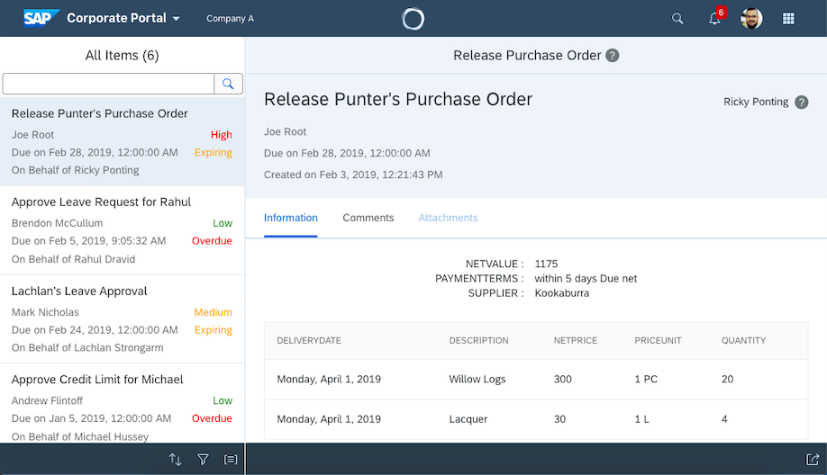
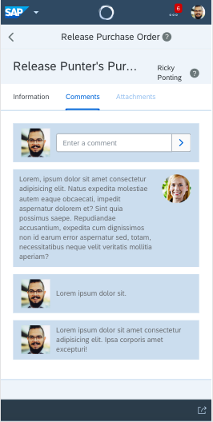
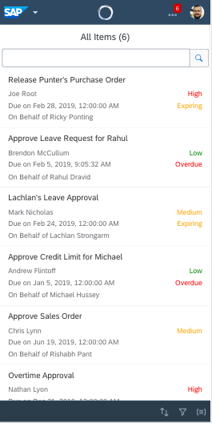

<!-- 


 -->


# Fundamental NGX Master-Detail Demo

This application was built using Angular components that are a part of the [fundamental-ngx](https://sap.github.io/fundamental/) library. For quick and easy access to mockdata it connects to a read-only [Google Cloud Firestore](https://firebase.google.com/) via [Angular Fire](https://github.com/angular/angularfire2). The app layout is based on the popular SAP Fiori My Inbox application.

This app was intended to provide a customizable example of what the new Fundamental libraries are capable of.

This demo is currently hosted [here](https://fiori-ngx-master-detail.firebaseapp.com).

## Roadmap

As this was prototyped in a very short timeframe, there are a number of aspects that will need to be addressed going forward:
* **Testing**
* Improve responsiveness (compact / cozy equivalent padding, margin, etc)
* Inclusion of more components (e.g. modals, forms)
* Implement a base service and inherit
* Replace Firestore OData support ()
* Mockserver (I started setting up a rudimentary mockserver in the `feat/firestore-mockserver` branch)

The app was based on library components available in early February 2019, and unfortunately the downloadable API did not feature the `fd-page` information, so I adapted the `fd-panel` component.

## Installation

To download and use this demo, you will first need to install [NPM](https://www.npmjs.com/get-npm).

After downloading / cloning this project, on the root directory run:
```
npm i
``` 

## Development server

Run `ng serve` for a dev server. Navigate to `http://localhost:4200/`. The app will automatically reload if you change any of the source files.

## Build

Run `ng build` to build the project. The build artifacts will be stored in the `dist/` directory. Use the `--prod` flag for a production build.

## Contributions

Pull requests are welcome. For major changes, please open an issue first to discuss what you would like to change.

## Acknowledgments

Thank you to Matt Sloane, Mehdi Atefi and [Lachlan Miller](https://github.com/lmiller1990) for your contributions to v1!

## License
[MIT](https://choosealicense.com/licenses/mit/)


